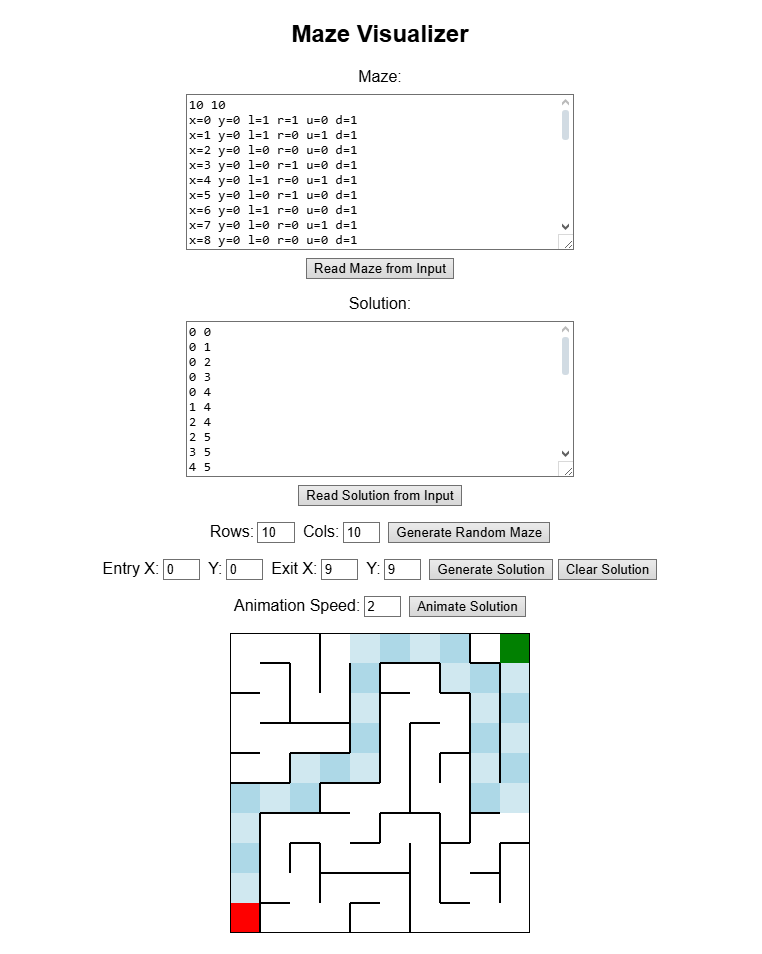

# Maze Visualizer

A simple interactive maze generator and solver in the browser.

## How to Run

Open `index.html` in your browser, or visit https://deniz1433.github.io/mazeVisualizer/ if it's up.

## Features

- Random maze generation
- Manual maze + solution input
- Solution animation
- Validity checking for inputted solutions

## Demo

### Solve and Animate  

This tool was made to aid with maze vizualization to check the correctness of the maze generation and solving algorithms we were tasked to implement as our homework on the CS300 Data Structures course at Sabancı University. I made this to be a better alternative to the provided CLI tool that only gave ASCII output.
